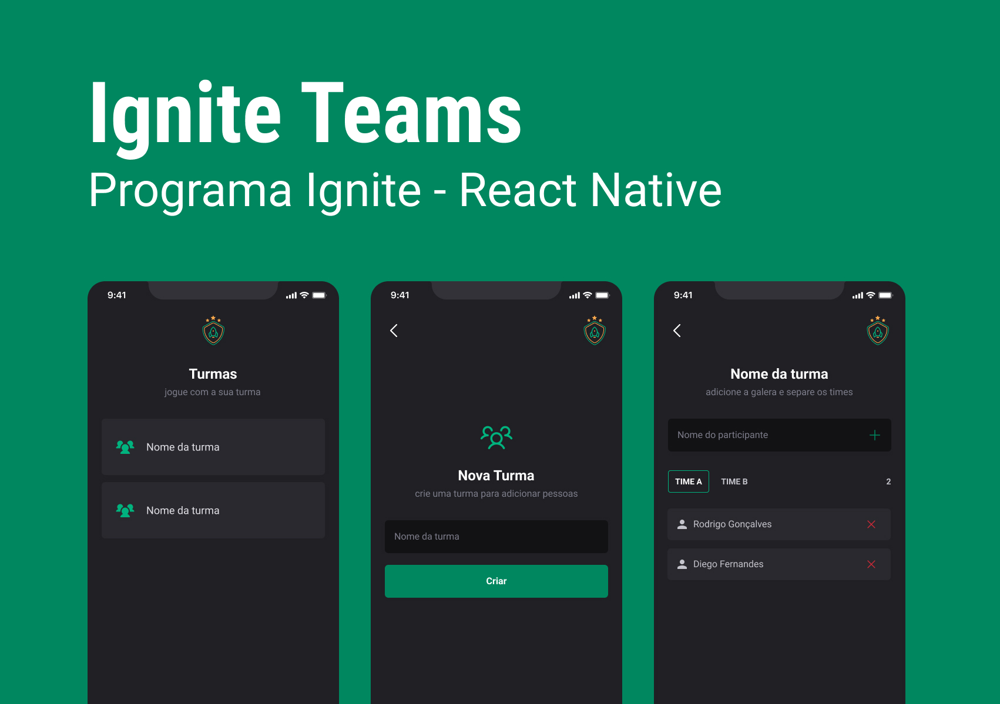

<h1 align="center">
  
</h1>

<p align="center">
  

 

 
</p>

## 💻 Projeto

Essa aplicação é um resultado de um protótipo desenvolvido dentro do curso Ignite da @Rocketseat, que tem como propósito, construir uma aplicação mobile com React Native que ajude a gerenciar grupos e times de pessoas para suas jogatinas e streams.
<br>
<br>

## ✨ Tecnologias

Esse projeto foi utilizado as seguintes tecnologias e bibliotecas:

- [x] Expo
- [x] React Native
- [x] Typescript
- [x] Async Storage
- [x] Styled Components
- [x] React Navigation


## 📄 Pré-requisitos

- [x] NodeJS >= 14.0
- [x] yarn
- [x] Expo >= 44.0.2
- [x] Expo-CLI

## Executando o projeto

Instale as dependências com o comando **yarn** em seu terminal e execute a aplicação em seu Android ou IOS com Expo:

```cl
expo-cli start
```
<br />

## 📄 Licença

Esse projeto está sob a licença MIT. Veja o arquivo [LICENSE](LICENSE) para mais detalhes.
